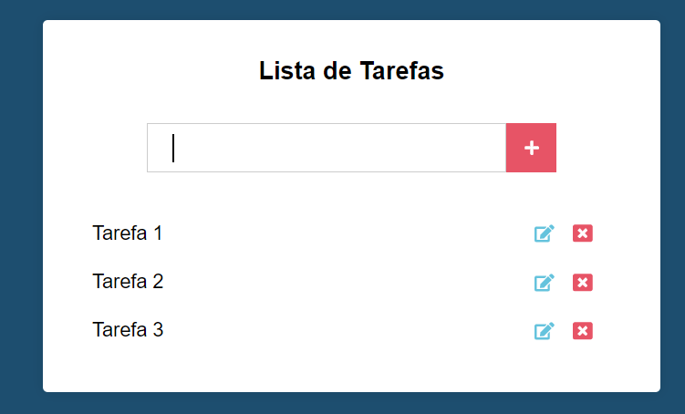

# Formulário de Criação de Cadastro

O seguinte programa foi desenvolvido utilizando como base o curso **React com Componentes de Classe** através do **Udemy: Curso de Javascript e Typescript do Básico ao Avançado**. 

## Objetivo

Criação de uma **Lista de Tarefas** com as seguintes funções:

* O Usuário poderá criar tarefas;
* O Usuário poderá editar suas tarefas criadas;
* O Usuário poderá excluir suas tarefas criadas;
* As tarefas criadas poderão ser acessadas novamente mesmo que o usuário saia da página;

## Conceitos Utilizados

Para a criação deste projeto, foram utilizados:

* Conhecimentos de `REACT`:
  * Componentização;
  * *setState*
* Local Storage;
* Conhecimentos de form utilizando `HTML` e `CSS`;
* Lógica de programação dentro do `JS`  

## Imagem Demonstrativa

